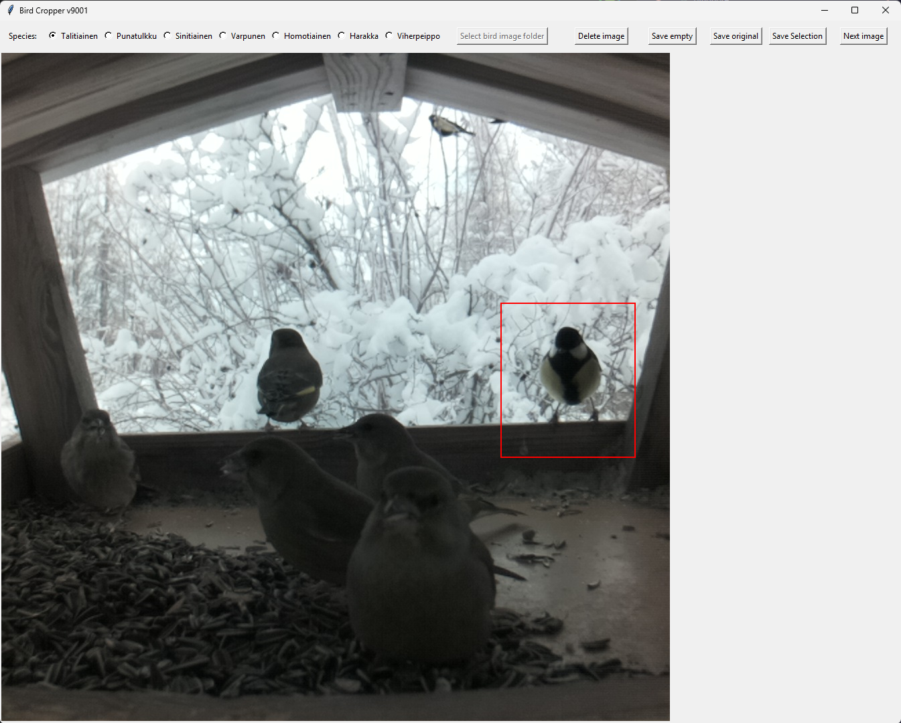

# Bird Cropper 

Bird Cropper is a Python utility designed for efficient data labeling. It allows users to rapidly crop birds from large datasets and automatically sort them into species-specific folders.



## Prerequisites

- Python 3.x (Tested on Python 3.13)

- Pip package manager


## How to run
1. Open terminal and clone project
```
git clone https://github.com/harrvayr/bird_cropper.git
```
2. Open terminal into rootfolder of the project and create python virtual environment into folder ".venv" with command
```
python -m venv .venv
```
3. Activate virtual environment. Commands at https://docs.python.org/3/library/venv.html#how-venvs-work
For windows cmd the command would be
```
.venv\Scripts\activate.bat
```

4. Install dependencies
```
pip install -r requirements.txt
```

5. Run the app
```
python main.py
```
## How to use

1. <b>Select image folder:</b> Press the button to select the folder where the original images are
<p>

2. <b>Crop:</b> Select the area you want to crop by holding left mouse button and dragging the mouse
<p>

3. <b>Select species:</b>Select the correct bird species from the top menu or use number keys
<p>

4. <b>Save:</b> Press the save selection button to save the cropped image. When saving first image you must select the folder where the images will be saved. 
<p>

5. <b>Repeat: </b> Select new area to crop or change to next image by pressing Next Image button or Left Shift

### Hotkeys

| Key | Function |
| :--- | :--- |
| **Left Mouse** | Drag to select crop area |
| **Spacebar** | Save the cropped area |
| **1, 2, 3...** | Select bird species (from left to right) |
| **Left Shift** | Change to next image |
| **E** | Save image to "empty" folder |
| **Q** | **DELETE Image** (No confirmation - use with caution!) |

## How to Add Species

The list of bird species is customizable. Current list contains bird species in Finnish. To add or remove species, you need to edit the `bird_species.py` file.

1.  Open `bird_species.py` in your text editor or IDE.
2.  Locate the `class BirdSpecies(Enum):` block.
3.  Add your new species as a new line within the class. e.g. SPECIES_4 = "Bird"

**Important:** The order of the species in this list determines the hotkeys. The first species listed corresponds to key **1**, the second to **2**, and so on.

```python
# Example inside bird_species.py
class BirdSpecies(Enum):
    SPECIES_1 = "Great Tit"      
    SPECIES_2 = "Blue Tit"
    EMPTY = "Empty"       
    # Add your new species below
    SPECIES_3 = "Magpie"
```